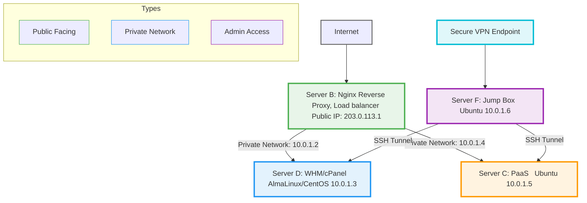
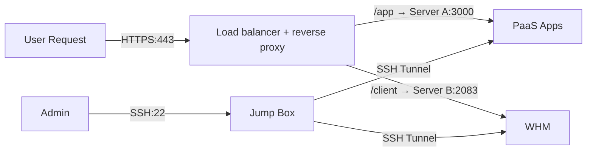
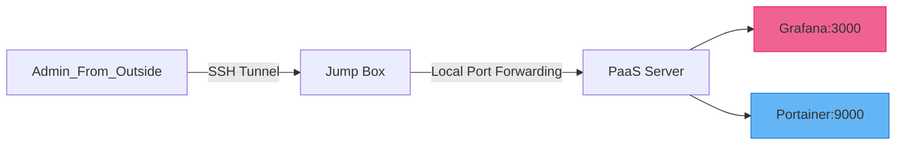
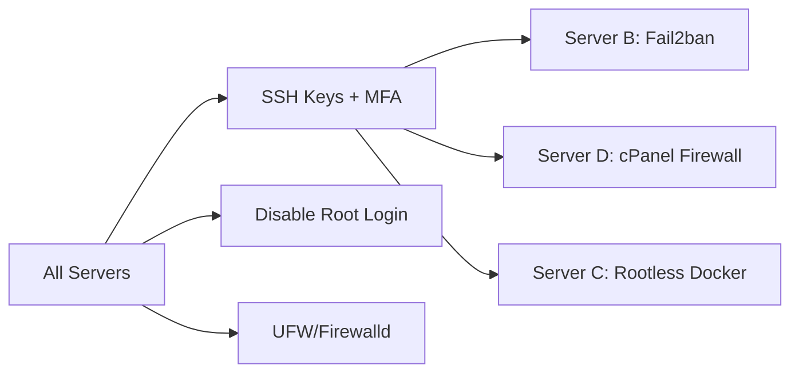
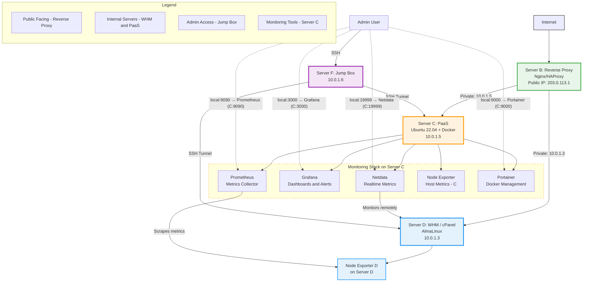

# PaaS- Setup

## Goal

**Self-Hosted PaaS + Traditional Hosting**

Building a **self-hosted server platform** to:

1. **Host client applications** (web apps, APIs, etc.) using platforms like:
    - **Coolify / CapRover** (for modern apps like Node.js, PHP, etc.)
    - **Docker & SSH access** (for resellers to install their own dashboards)
2. **Offer traditional web hosting** using:
    - **WHM** (for reseller control)
    - **cPanel** (for individual website owners)
3. **Support all types of apps**, including:
    - PHP, WordPress, Laravel
    - Node.js, Python, static sites
    - Databases like MySQL, PostgreSQL
4. **Monitor everything** using:
    - **Grafana + Prometheus + Node Exporter + Netdata** (for resource usage and alerts)
    - **Portainer** (for container management, admin-only)
5. **Secure and manage network traffic** using:
    - **Nginx reverse proxy**
    - **Firewall rules**
    - **Jump box (Server F)** for safe SSH tunneling

## **Architecture Overview (Components Table)**

| **Component** | **Role** | **OS/Software** |
| --- | --- | --- |
| **Server B** | Reverse Proxy & Load Balancer | Ubuntu + Nginx/HAProxy |
| **Server D** | WHM/cPanel Hosting | AlmaLinux/CentOs + WHM/cPanel |
| **Server C** | PaaaS (Docker Apps + Monitoring) | Ubuntu 22.04 + Caprover/Coolify |
| **Server F** | Admin Jump Box | Ubuntu + SSH |

### Topology

**Key**:

- **Public Traffic**: Only Server (B) is exposed.
- **Private Traffic**: Servers D and C are isolated.
- **Admin Access**: Server F acts as a secure gateway.

### Traffic flow

### Monitoring access

### Monitoring setup

| **Tool** | **Purpose** | **Access Method** |
| --- | --- | --- |
| **Grafana** | Visualize metrics (CPU, RAM, etc.) | Via SSH tunnel through Server F |
| **Portainer** | Docker container management | Internal IP (only from Server F) |
| **Prometheus** | Collect metrics from Docker/Apps | Integrated with Grafana |
| **Netdata** | Real-time, live system & container stats | Via SSH tunnel through Server F |

### Security Hardening

## **Core Technologies Used**

1. **Nginx + HAProxy** – Reverse proxy for domain routing, SSL termination, and load balancing
2. **WHM/cPanel** – Web hosting control panel for managing domains, email, and hosting accounts
3. **Coolify** – Self-service app hosting (like Heroku)
4. **CapRover** – App deployment platform
5. **Portainer** *(Read-Only Mode)* – View logs, stats, and resource usage of Docker containers
6. **Grafana + Netdata** – Server & app performance monitoring

### Nginx reverse proxy

### WHM/cpanel

### **WHM vs. cPanel: Key Differences**

| **Feature** | **WHM (WebHost Manager)** | **cPanel** |
| --- | --- | --- |
| **Purpose** | **Admin Control Panel** (for server owners/resellers) | **User Control Panel** (for website owners) |
| **Who Uses It?** | Hosting providers, resellers, sysadmins | Website owners, bloggers, small businesses |
| **Access Level** | Full root/server control | Limited to one website (per account) |
| **Main Functions** | - Create cPanel accounts- Manage server security- Install PHP/MySQL versions- Monitor server resources | - Manage emails- Upload website files- Install WordPress- Create databases |
| **Pricing** | Included with cPanel license (more expensive) | Cheaper (but requires WHM for server management) |
| **Example Use Case** | You own a VPS and sell hosting to clients | Your client wants to manage their website & emails |

- Recommended WHM/cPanel License Options in India
    
    
    | Provider | License Type | Price (INR/month) | Features |
    | --- | --- | --- | --- |
    | **IndiaHost** | WHM Root Server | ₹3,999 | Unlimited cPanel & reseller accounts, includes CloudLinux, LiteSpeed, Imunify360, KernelCare, and WHM management. Ideal for comprehensive on-premise setups. |
    | **Aquahost** | cPanel Dedicated Server | ₹450 | Unlimited accounts, includes Softaculous, SitePad, and FleetSSL licenses. |
    | **IndiaHost** | cPanel Dedicated Server | ₹349 | Unlimited cPanel accounts, includes Softaculous and FleetSSL licenses. |
    | **LicenseZone** | WHM Reseller License | ₹149 | Unlimited domains, free installation, and official updates. |
    
    **Note:** Prices are exclusive of GST (18%) unless specified.
    

### Coolify

## **✅ What You CAN Host on Coolify**

### **1. Web Apps & APIs**

- **Frontend Frameworks**
    - React, Next.js, Vue.js, Svelte, Angular
    - Static sites (HTML/CSS/JS)
- **Backend Services**
    - Node.js, Python (Django/Flask), Ruby on Rails
    - PHP (Laravel, Symfony)
    - Java (Spring Boot), Go, Rust

## **❌ What Coolify CANNOT Do**

- **No Email Hosting** (No SMTP, IMAP, or webmail like Roundcube).
- **No cPanel-like GUI** (No file manager, Softaculous, or `.htaccess` editor).
- **No Windows Apps** (Linux/Docker only).

## **🚫 When Should You Avoid Coolify?**

✖ **You need email hosting** (use cPanel/Migadu instead).

✖ **Your clients need cPanel** (non-tech users).

### **2. Databases**

- MySQL, PostgreSQL, MongoDB, Redis
- (Managed via Coolify’s **built-in database provisioning**)

### **3. Docker & Microservices**

- **Pre-built Docker images** (WordPress, Ghost, Strapi)
- **Custom Dockerfiles** (Any containerized app)
- **Microservices** (Node + Redis + DB combos)

### **4. Serverless-ish Functions**

- Coolify can auto-deploy **server-like functions** (e.g., APIs with auto-scaling).
    
    ## **🚀 How to Deploy Apps on Coolify?**
    
    1. **Git-Based Deployment**
        - Connect GitHub/GitLab → Coolify auto-deploys on push.
    2. **Docker Containers**
        - Deploy `docker-compose.yml` or pre-built images.
    3. **One-Click Apps**
        - WordPress, Ghost, Strapi (via Coolify’s templates).

## **🔥 Coolify vs. Traditional Hosting**

| **Feature** | **Coolify** | **cPanel/Shared Hosting** |
| --- | --- | --- |
| **App Hosting** | ✅ (Any Docker/Git app) | ✅ (PHP/MySQL only) |
| **Email Hosting** | ❌ | ✅ |
| **Database GUI** | ✅ (Adminer/CLI) | ✅ (PHPMyAdmin) |
| **Auto-Deploy from Git** | ✅ | ❌ |
| **Docker Support** | ✅ | ❌ |
| **Free SSL (Let’s Encrypt)** | ✅ | ✅ |

## **💡 When Should You Use Coolify?**

✔ **You’re a developer** (not a traditional web host).

✔ **You use Docker/Git** (and don’t need emails).

✔ **You want auto-scaling & modern infra**.

[Self-hosting Your Website with Coolify v4: A Step-by-Step Guide](https://billyle.dev/posts/self-hosting-your-website-with-coolify-v4-a-step-by-step-guide#coolify-onboarding-experience)

### CapRover

## 🚀 **What is CapRover?**

CapRover is a lightweight app deployment and server management tool that:

- Uses Docker under the hood
- Lets you deploy apps with one-click or via Git push
- Provides a user-friendly **web dashboard** and **CLI**
- Supports modern web apps (Node, PHP, Python, static sites, etc.)

## ⚙️ **System Requirements**

- A VPS or bare-metal server with:
    - 1+ vCPU
    - 1GB+ RAM (2GB recommended)
    - Ubuntu/Debian-based OS
- Docker must be installed (CapRover installs Docker if not present)

## 🧑‍💼 **User Roles**

| Role | Access Level |
| --- | --- |
| Admin | Full access to dashboard & settings |
| App Owner | Access to only their apps (optional plugin) |
| Developer | Git push access only |

## 🔄 **Backup & Restore**

- Manual or scheduled Docker volume backups
- Export CapRover configuration

## 💡 **Pros vs Cons**

**Pros:**

- Super easy to install and use
- Self-hosted and open-source
- Great for small teams or startups
- Built-in HTTPS, domains, volume support

**Cons:**

- Lacks deep multi-user role management
- Less granular monitoring (compared to Grafana)
- Not ideal for huge enterprise setups (better for small-medium workloads)
- You can snapshot app states and storage

## 🧰 **Main Features of CapRover**

| Feature | Description |
| --- | --- |
| 🔧 One-click App Deployment | Choose from templates or Git repo |
| 🔄 Docker-based | Every app runs in its own container |
| 🌐 Web UI | Easy-to-use dashboard for managing apps |
| 🐳 Docker Registry Support | Deploy from your own Docker images |
| 📦 Built-in SSL (Let's Encrypt) | Free HTTPS certificates |
| 📁 Persistent Volumes | For apps needing storage |
| 🛠️ Environment Variables | Easily configurable per app |
| 🔄 Load Balancer + Reverse Proxy | Auto-configured with NGINX |
| 🛡️ Basic Firewall | Blocks unused ports |
| 📤 Git-based Deploy | Deploy directly via `git push` |

## 📦 **Use Cases for Your Business**

| Use Case | Description |
| --- | --- |
| Developer Hosting Panel | Let devs deploy via Git |
| Internal Web Apps | Deploy admin tools, APIs, dashboards |
| Static Website Hosting | With HTTPS & caching |
| Multi-Tenant SaaS Apps | One app per container |
| Reseller Hosting | Each user gets a CapRover app or team access |

## 🔐 **Security Model**

- HTTPS with Let's Encrypt (auto-renewing)
- Docker container isolation
- Basic firewall enabled by default (only HTTP/HTTPS/SSH open)
- App access controls with passwords and secrets
- Optional login via GitHub or SSO

## 🖧 **Network & Reverse Proxy**

- CapRover uses **NGINX** internally
- Maps subdomains to apps automatically (`app1.yourdomain.com`)
- Supports custom domains and wildcard SSL

## 🏁 **When to Use CapRover in Your Hosting Stack**

✅ Ideal for:

- Self-hosted app deployment panel for your developer clients
- A simple PaaS offering alongside Coolify
- Quick Git-based deployments
- Web agency or SaaS MVP hosting

🚫 Not ideal if:

- You need WHM-like multi-user account management
- You want detailed billing or metering

## When to Use

- **Use Coolify** if:
    - You want a modern panel for customers
    - You need Docker Compose + team access
- **Use CapRover** if:
    - You want simple Git-based deploys
    - You host for developers or personal use

### Portainer

### **(For You - Admin Control)**

| **Aspect** | **Details** |
| --- | --- |
| **Type** | Docker management GUI |
| **Purpose** | Simplifies container management |
| **Key Features** | - Web-based interface- No CLI required- User/team management- Container monitoring |
| **For Developers** | Easy Docker container management |

**Purpose**:

- **Visual management tool for Docker containers** (which Coolify uses behind the scenes).
- Lets you **override, debug, or fix things** if Coolify has issues.

**Key Features**:

🔧 **Container management** (Start/stop/restart containers)

🔧 **Volume & network configs** (For databases, file storage)

🔧 **Web-based terminal** (Run commands without SSH)

🔧 **Access control** (Limit team members’ permissions)

**What You’ll Use It For**:

- Fixing a crashed client app (e.g., PHP-FPM errors).
- Checking database container logs.
- Manually scaling resources (RAM/CPU) for busy apps.

**Why Use It?**

- Coolify abstracts Docker, but **Portainer gives you raw control** when needed.

[Huge Guide to Portainer for Beginners - Codeopolis](https://codeopolis.com/posts/beginners-guide-to-portainer/)

### Grafana

**Grafana (For Monitoring & Alerts) – *Admin Only***

| **Aspect** | **Details** |
| --- | --- |
| **Type** | Monitoring and observability platform |
| **Purpose** | Tracks system and application performance |
| **Key Features** | - Real-time dashboards   - Alerting system   - Multi-data source support   - Resource usage tracking |
| **For Developers** | Monitor their app performance |
| **For Hosting Providers** | Track server health and client resource usage |

### ✅ **Purpose:**

- **Real-time dashboards** to monitor server health and app performance.
- Alerts you **before clients complain** (e.g., high CPU, low disk space).

### 📊 **Key Metrics to Track**:

| Component | Metrics Example |
| --- | --- |
| **Server** | CPU, RAM, Disk usage, Temperature |
| **PHP Apps** | Request latency, errors, uptime |
| **MySQL** | Query speed, connection count, slow queries |
| **Coolify** | Deployment issues, container resource limits |
| **Containers** | Per-app memory, CPU, I/O usage (via cAdvisor, Node Exporter, Netdata) |

### 🎯 **What You’ll Use It For**:

- Spotting a client’s app that’s hogging RAM or CPU.
- Detecting DDoS attacks from **sudden network traffic spikes**.
- Proving performance issues are **caused by client-side apps**, not your server.

### 🧠 **Why Use It?**

- Coolify has **basic internal metrics**, but:
    - **Grafana gives deep visibility**.
    - **Prometheus + Node Exporter** let you analyze long-term performance trends.
    - **Netdata gives live, per-second updates** (great for debugging and fast insights).

---

### Netdata

### **Netdata (Real-time Live Metrics)**

| **Aspect** | **Details** |
| --- | --- |
| **Type** | Real-time monitoring dashboard |
| **Purpose** | Live view of server and container performance |
| **Key Features** | - 1-second interval updates   - Auto-detects Docker, apps, databases  - Interactive web UI |
| **Access** | Admin only via SSH tunnel through Server F |

> 💡 Use Netdata alongside Grafana for instant insights and troubleshooting spikes in real time.
> 

## Whole Architecture

[www.mermaidchart.com](https://www.mermaidchart.com/raw/5fb06e22-86a9-400e-9181-dcfa798c89b9?theme=light&version=v0.1&format=svg)